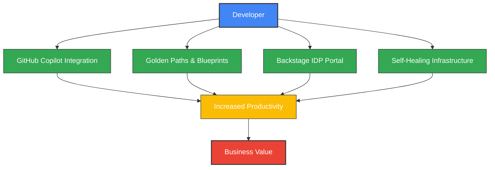
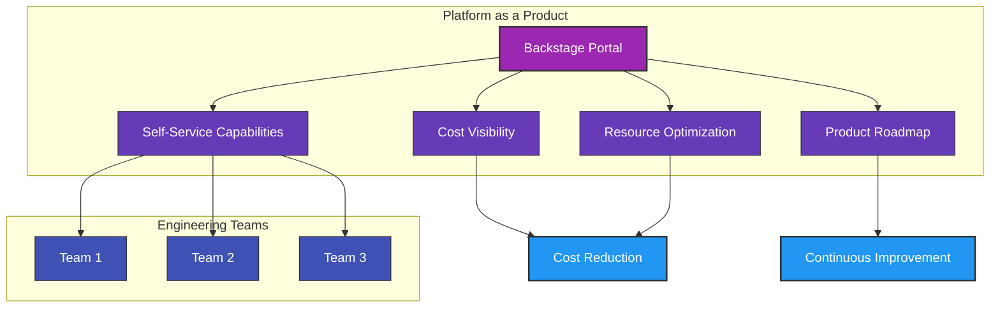
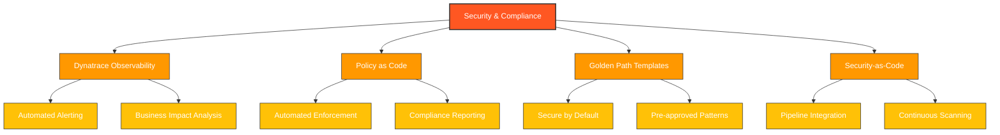
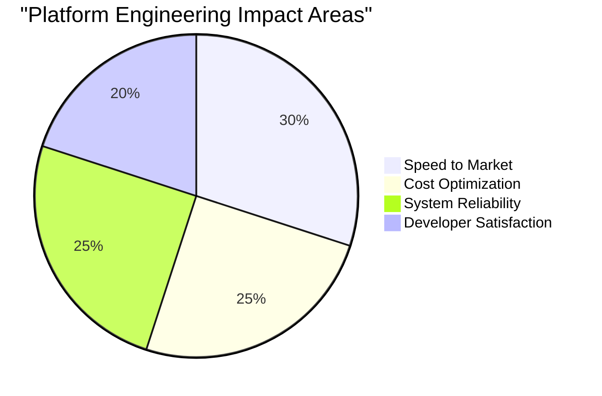

# Top 3 Platform Engineering Objectives for 2025

## Agenda

- Enhanced Developer Experience & Productivity
- Platform as a Product with FinOps Integration
- Implementing Robust Security & Compliance Automation

## Objective 1: Enhance Developer Experience & Productivity

**Why It Matters:**

- Developers spend 40% of time on infrastructure setup instead of coding, directly impacting business agility
- High cognitive load reduces innovation and efficiency
- Inconsistent development environments lead to "works on my machine" problems

**Key Initiatives:**

- **Implement Internal Developer Platform (IDP)**: Deploy Backstage as a centralized developer portal for service discovery and documentation
- **Establish Golden Paths & Blueprints**: Create standardized, validated paths for common development tasks with embedded best practices
- **GitHub Copilot Integration**: Integrate AI-assisted coding tools to accelerate development and reduce boilerplate code
- **Templated Environments**: Provide pre-configured development environments with all necessary tools and dependencies
- **API-First Strategy**: Ensure all platform capabilities are accessible via well-documented APIs

**Pareto Efficiency Focus:**

- Identify and optimize the 20% of developer workflows that consume 80% of engineering time
- Target templates and golden paths for the most frequently used services and patterns

**Potential Benefits/Measures:**

- 30% reduction in development cycle time
- 60% faster onboarding for new developers
- 40% improvement in DORA metrics (deployment frequency, lead time, MTTR)
- 85% developer satisfaction rating

---

## Objective 2: Platform as a Product with FinOps Integration

**Why It Matters:**

- Traditional platform teams struggle with adoption and demonstrating value
- Cloud costs continue to escalate without proper governance
- Engineering teams need self-service capabilities with cost awareness

**Key Initiatives:**

- **Backstage as Central IDP**: Implement comprehensive developer portal with service catalog, documentation, and scaffolding
- **FinOps Dashboard Integration**: Create real-time cost visibility within the developer workflow
- **Resource Optimization Automation**: Implement automatic scaling, rightsizing, and cleanup of unused resources
- **Product Management Approach**: Establish platform roadmap, SLAs, and customer feedback mechanisms
- **Reusable Components Library**: Create standardized, approved components for common architecture patterns

**Pareto Efficiency Focus:**

- Apply 80/20 rule to platform features: prioritize the 20% of capabilities that deliver 80% of value
- Focus cost optimization efforts on the 20% of resources that represent 80% of cloud spend

**Potential Benefits/Measures:**

- 90% platform adoption across engineering teams
- 25% reduction in cloud spend without sacrificing performance
- 50% decrease in platform-related support tickets
- Platform NPS score above 40

---

## Objective 3: Implementing Robust Security & Compliance Automation

**Why It Matters:**

- System complexity increases attack surface with distributed architectures
- Security threats are more sophisticated and persistent than ever
- Regulatory requirements for resilience continue to expand

**Key Initiatives:**

- **Dynatrace Implementation**: Deploy comprehensive observability with Davis AI for anomaly detection and automated root cause analysis
- **Security-First Golden Paths**: Create templates with security controls baked in from the start
- **CI/CD Security Integration**: Implement automated scanning in pipelines (SAST, DAST, SCA)
- **Policy-as-Code**: Enforce compliance requirements using OPA, Kyverno, or similar tools
- **Automated Compliance Reporting**: Generate real-time compliance dashboards via Dynatrace

**Pareto Efficiency Focus:**

- Identify and prioritize the 20% of vulnerabilities that represent 80% of security risk
- Focus compliance automation on the 20% of controls that satisfy 80% of regulatory requirements

**Potential Benefits/Measures:**

- 75% reduction in security incidents
- 90% reduction in compliance reporting effort
- 60% faster vulnerability remediation
- Zero critical findings in external security audits

---

## Why These Objectives Matter for Our Future

The organization that masters these three objectives will achieve Pareto-efficient operations:

1. **Move Faster** - Empower developers to deliver value at speed through golden paths and AI assistance
2. **Optimize Resources** - Apply 80/20 rule to ensure technology investments deliver maximum value
3. **Build Trust** - Create systems that customers and regulators can depend on
4. **Win in the Market** - Transform technology from a constraint to a competitive advantage

**The platform team that executes on these objectives becomes the cornerstone of the company's success in 2025 and beyond.**

---

## Key Success Factors

- Prioritize backend API quality and stability before frontend development
- Ensure Backstage is properly integrated with existing systems
- Apply Pareto principle to maximize impact with limited resources
- Measure and communicate value delivered continuously

---

## My Role in Driving These Objectives

As a platform engineering leader, I would:

- Establish the vision and strategy aligned with business goals
- Build and develop high-performing platform engineering teams
- Create robust feedback mechanisms with engineering stakeholders
- Implement data-driven decision making for continuous improvement
- Foster a culture of innovation, reliability, and continuous learning

**I'm excited about the opportunity to lead these transformative objectives and help the organization achieve its technology and business goals for 2025.**
