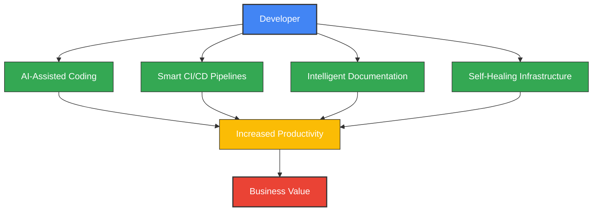
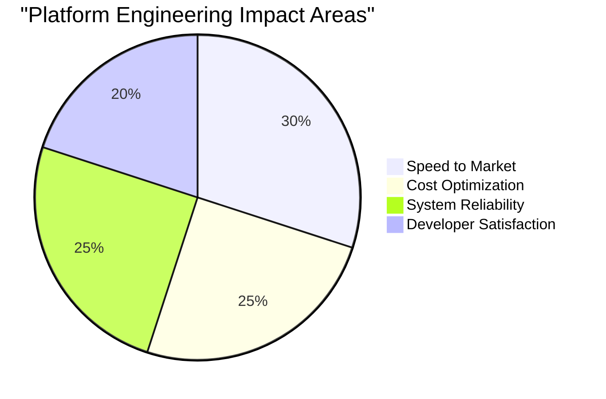

# Top 3 Platform Engineering Objectives for 2025

## Agenda

- Enhanced Developer Experionce & Productivity
- Platfrom as a Product with FinOps integration
- Implementing Robust Security & Compliance Autoamtion

## Objective 1: Enhance Developer Experience & Productvity

**Why It Matters:**

- Developers spend time on other tasks like infrastructure setjup instead odf codeing. Directly impacting business agility and time-to-market
- High cognitive load reducnes innovation and efficiency

**Key Initiatives:**

- Self-Service Platfroms (IDP): Enables developers to deploy and manage service independently
- Deploy AI-assisted code generation, review and refactoring tools.
- Standardised Tooling: Provide reusable CI/CD pipelines/workflows, templates and/or SDK's
- Observability & Feedback Loops: implement better Logging, monitoring and developer dashboards

**Potential Benefits/Measures:**

- Faster development cycles and reduced onboarding time
- Higher develoepr satidfaction. Reduced cognitive load
- DORA metrics to measure improvments

---

## Objective 2: Platfrom as a Product with FinOps integration

**Why It Matters:**

- Traditional platform teams struggle with adoption and demonstrating value
- Cloud costs continue to escalate without proper governance
- Engineering teams need self-service capabilities with cost awareness

**Key Initiatives:**

- Implement internal developer portals with comprehensive self-service capabilities
- Deploy real-time cost visibility dashboards for all engineering teams
- Create automated resource optimization recommendations
- Establish clear platform product roadmaps with stakeholder feedback loops

**Potential Benefits/Measures:**

- 90% platform adoption across engineering teams
- 20% reduction in cloud spend without sacrificing performance
- 50% decrease in platform-related support tickets
- Consistent positive feedback in quarterly platform NPS scores

---

## Objective 3: Implementing Robust Security & Compliance Autoamtion

**Why It Matters:**

- System complexity is increasing exponentially with distributed architectures
- Security threats are more sophisticated and persistent than ever
- Regulatory requirements for resilience continue to expand

```mermaid
graph TD
    A[Platform Resilience] --> B[Chaos Engineering]
    A --> C[Comprehensive Observability]
    A --> D[Automated Disaster Recovery]
    A --> E[Security-as-Code]
    
    B --> F[Failure Injection]
    B --> G[Game Days]
    
    C --> H[Metrics]
    C --> I[Logs]
    C --> J[Traces]
    C --> K[Business Context]
    
    D --> L[Regular DR Testing]
    D --> M[Automated Failover]
    
    E --> N[Pipeline Integration]
    E --> O[Continuous Compliance]
    
    style A fill:#FF5722,stroke:#333,stroke-width:2px,color:white
    style B fill:#FF9800,stroke:#333,stroke-width:1px,color:white
    style C fill:#FF9800,stroke:#333,stroke-width:1px,color:white
    style D fill:#FF9800,stroke:#333,stroke-width:1px,color:white
    style E fill:#FF9800,stroke:#333,stroke-width:1px,color:white
    style F fill:#FFC107,stroke:#333,stroke-width:1px,color:white
    style G fill:#FFC107,stroke:#333,stroke-width:1px,color:white
    style H fill:#FFC107,stroke:#333,stroke-width:1px,color:white
    style I fill:#FFC107,stroke:#333,stroke-width:1px,color:white
    style J fill:#FFC107,stroke:#333,stroke-width:1px,color:white
    style K fill:#FFC107,stroke:#333,stroke-width:1px,color:white
    style L fill:#FFC107,stroke:#333,stroke-width:1px,color:white
    style M fill:#FFC107,stroke:#333,stroke-width:1px,color:white
    style N fill:#FFC107,stroke:#333,stroke-width:1px,color:white
    style O fill:#FFC107,stroke:#333,stroke-width:1px,color:white
```

**Key Initiatives:**

- Implement chaos engineering practices across all critical systems
-Integrating security scanning tools into CI/CD pipelines/Workflows (e.g. static analysis, vulnerability scanning)
- Implementing policy-as-code to enforce complianace requirments automatically
- Utilising cloud-native security tools for runtimr threat detection and response
- Implementing automated compliance reporting

**Potential Benefits/Measures:**

- Reuced security risks and vulnerabilities
- Imporved complianace posture
- Faster remediation of security issues

---

## Why These Objectives Matter for Our Future

The organization that masters these three objectives will:

1. **Move Faster** - Empower developers to deliver value at speed
2. **Optimize Resources** - Ensure all time/money spent on technology delivers maximum value
3. **Build Trust** - Create systems that customers and regulators can depend on

**The platform team that executes on these objectives becomes the cornerstone of the company's success in 2025 and beyond.**

---

## My Role in Driving These Objectives

As a platform engineering leader, I would:

- Establish the vision and strategy aligned with business goals
- Build and develop high-performing platform engineering teams
- Create robust feedback mechanisms with engineering stakeholders
- Implement data-driven decision making for continuous improvement
- Foster a culture of innovation, reliability, and continuous learning

**I'm excited about the opportunity to lead these transformative objectives and help the organization achieve its technology and business goals for 2025.**# Top 3 Platform Engineering Objectives for 2025

---

## Why These Objectives Matter for Our Future

The organization that masters these three objectives will:

1. **Move Faster** - Empower developers to deliver value at speed
2. **Optimize Resources** - Ensure every dollar spent on technology delivers maximum value
3. **Build Trust** - Create systems that customers and regulators can depend on
4. **Win in the Market** - Transform technology from a constraint to a competitive advantage

**The platform team that executes on these objectives becomes the cornerstone of the company's success in 2025 and beyond.**

---

## My Role in Driving These Objectives

As a platform engineering leader, I would:

- Establish the vision and strategy aligned with business goals
- Build and develop high-performing platform engineering teams
- Create robust feedback mechanisms with engineering stakeholders
- Implement data-driven decision making for continuous improvement
- Foster a culture of innovation, reliability, and continuous learning
