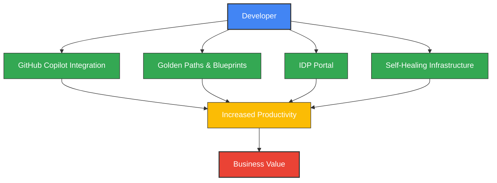
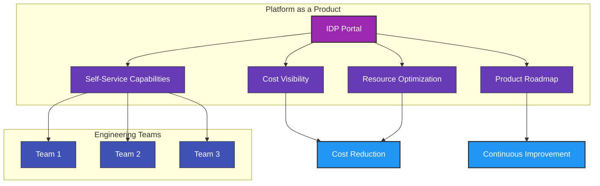
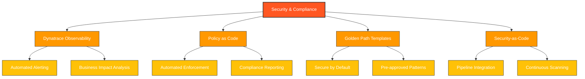
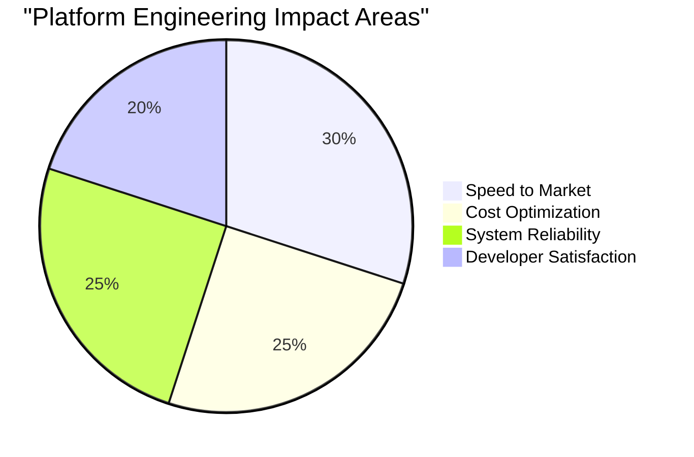

# Platform Engineering Objectives

## Agenda

- Enhanced Developer Experience & Productivity
- Platform as a Product with FinOps Integration
- Implementing Robust Security & Compliance Automation

## Objective 1: Enhance Developer Experience & Productivity

**Why It Matters:**

- Developers spend significant time on infrastructure setup instead of coding, directly impacting business agility
- Considerable effort goes into repetitive tasks like environment configuration, dependency management, and access provisioning
- Time consumed by CI/CD pipeline maintenance, debugging build failures, and troubleshooting deployment issues
- Hours spent on compliance documentation, security reviews, and audit preparation
- Significant overhead managing integration with external services, API gateways, and authentication systems
- Manual testing environments creation and test data management drains development resources
- High cognitive load reduces innovation and efficiency
- Inconsistent development environments lead to "works on my machine" problems

**Key Initiatives:**

- **Implement Internal Developer Platform (IDP)**: Deploy IDP as a centralized developer portal for service discovery and documentation
- **Establish Golden Paths & Blueprints**: Create standardized, validated paths for common development tasks with embedded best practices
- **GitHub Copilot Integration**: Integrate AI-assisted coding tools to accelerate development and reduce boilerplate code
- **Templated Environments**: Provide pre-configured development environments with all necessary tools and dependencies
- **API-First Strategy**: Ensure all platform capabilities are accessible via well-documented APIs

**Pareto Efficiency Focus:**

- Identify and optimize the developer workflows that consume the most engineering time
- Target templates and golden paths for the most frequently used services and patterns

**Potential Benefits/Measures:**

- Substantial reduction in development cycle time
- Faster onboarding for new developers
- Improvement in DORA metrics (deployment frequency, lead time, MTTR)
- Increased developer satisfaction ratings

---

## Objective 2: Platform as a Product with FinOps Integration

**Why It Matters:**

- Traditional platform teams struggle with adoption and demonstrating value
- Cloud costs continue to escalate without proper governance
- Engineering teams need self-service capabilities with cost awareness

**Key Initiatives:**

- **Central IDP**: Implement comprehensive developer portal with service catalog, documentation, and scaffolding
- **FinOps Dashboard Integration**: Create real-time cost visibility within the developer workflow
- **Resource Optimization Automation**: Implement automatic scaling, rightsizing, and cleanup of unused resources
- **Product Management Approach**: Establish platform roadmap, SLAs, and customer feedback mechanisms
- **Reusable Components Library**: Create standardized, approved components for common architecture patterns

**Pareto Efficiency Focus:**

- Apply 80/20 rule to platform features: prioritize the capabilities that deliver the most value
- Focus cost optimization efforts on the resources that represent the majority of cloud spend

**Potential Benefits/Measures:**

- High platform adoption across engineering teams
- Significant reduction in cloud spend without sacrificing performance
- Decrease in platform-related support tickets
- Positive platform NPS scores

---

## Objective 3: Implementing Robust Security & Compliance Automation

**Why It Matters:**

- System complexity increases attack surface with distributed architectures
- Security threats are more sophisticated and persistent than ever
- Regulatory requirements for resilience continue to expand

**Key Initiatives:**

- **Dynatrace Implementation**: Deploy comprehensive observability with Davis AI for anomaly detection and automated root cause analysis
- **Security-First Golden Paths**: Create templates with security controls baked in from the start
- **CI/CD Security Integration**: Implement automated scanning in pipelines (SAST, DAST, SCA)
- **Policy-as-Code**: Enforce compliance requirements using OPA, Kyverno, or similar tools
- **Automated Compliance Reporting**: Generate real-time compliance dashboards via Dynatrace

**Pareto Efficiency Focus:**

- Identify and prioritize the vulnerabilities that represent the greatest security risk
- Focus compliance automation on the controls that satisfy the majority of regulatory requirements

**Potential Benefits/Measures:**

- Significant reduction in security incidents
- Substantial reduction in compliance reporting effort
- Faster vulnerability remediation
- Improved performance in external security audits

---

## Why These Objectives Matter for Our Future

The organization that masters these three objectives will achieve Pareto-efficient operations:

1. **Move Faster** - Empower developers to deliver value at speed through golden paths and AI assistance
2. **Optimize Resources** - Apply 80/20 rule to ensure technology investments deliver maximum value
3. **Build Trust** - Create systems that customers and regulators can depend on
4. **Win in the Market** - Transform technology from a constraint to a competitive advantage

---

## Key Success Factors

- Prioritize backend API quality and stability before frontend development
- Ensure IDP is properly integrated with existing systems
- Apply Pareto principle to maximize impact with limited resources
- Measure and communicate value delivered continuously

---

## My Role in Driving These Objectives

As a platform engineering leader, I would:

- Establish the vision and strategy aligned with business goals
- Build and develop high-performing platform engineering teams
- Create robust feedback mechanisms with engineering stakeholders
- Implement data-driven decision making for continuous improvement
- Foster a culture of innovation, reliability, and continuous learning

---

# Speaking Notes

## Introduction

**Key Points:**
- Platform engineering is about creating a foundation that accelerates development, reduces costs, and enhances security
- These three objectives are interconnected and mutually reinforcing
- The presentation follows the "why, what, how" structure for each objective
- Emphasize that this is about working smarter, not harder – Pareto efficiency

**Delivery Tips:**
- Begin with a relatable pain point developers face daily
- Share a brief success story from another company that implemented platform engineering effectively
- Use the mermaid diagrams to visually reinforce connections between initiatives

## For Objective 1: Developer Experience

**Key Talking Points:**
- Developer time is our most precious resource – anything that wastes it damages our business velocity
- The cognitive load on developers has grown exponentially with system complexity
- IDP isn't just a tool – it's a fundamental shift in how developers interact with infrastructure
- Developers currently lose productive time to many non-coding activities that could be automated:
  * Manually provisioning and configuring development environments
  * Navigating complex access management systems for various services
  * Troubleshooting CI/CD pipeline failures unrelated to their code
  * Creating and managing test data across different environments
  * Implementing and maintaining security controls without specialized expertise
  * Documenting architecture for compliance requirements
  * Debugging infrastructure inconsistencies between environments
  * Coordinating releases across multiple dependent services

**Implementation Guidance:**
- Start with a developer survey to identify biggest pain points
- Create a small cross-functional team with respected developers to champion initial golden paths
- Begin with one high-value workflow and perfect it before expanding
- Measure before and after metrics for that workflow to demonstrate value
- Implement automated environment provisioning as an early win
- Create self-service tools for common developer needs (test data generation, service integration)

**Gaining Developer Buy-in:**
- Involve influential developers early in the design process
- Host regular demos and feedback sessions
- Create a "developer champions" program to recognize early adopters
- Show time savings with concrete examples from their daily work
- Implement quick feedback loops to rapidly iterate on platform features
- Demonstrate immediate value with automation of the most painful manual tasks

## For Objective 2: Platform as Product

**Key Talking Points:**
- Traditional platforms fail because they're built for IT convenience, not developer needs
- Cost optimization shouldn't require developer expertise in cloud architecture
- Treating the platform as a product means focusing on user experience and value delivery

**Implementation Guidance:**
- Begin with a clear service catalog of what your platform offers
- Implement progressive disclosure of complexity – simple options first, advanced settings available but not required
- Create a dedicated product owner role for the platform
- Start cost visualization with the highest-spend services

**Gaining Operations/Finance Buy-in:**
- Show current cloud waste and projected savings
- Create automated reports for finance that translate technical metrics to business value
- Implement quick wins for cost savings to build credibility
- Create shared KPIs between platform and operations teams

## For Objective 3: Security & Compliance

**Key Talking Points:**
- Security as friction fails; security as enablement succeeds
- Compliance is increasingly a competitive advantage, not just a requirement
- We must shift from point-in-time to continuous compliance

**Implementation Guidance:**
- Begin with a threat modeling exercise to prioritize security controls
- Implement security scanning in CI/CD pipelines before making other changes
- Create a security champion in each development team
- Build compliance into templates rather than adding as an afterthought

**Gaining Security Team Buy-in:**
- Involve security architects in golden path design from day one
- Create shared dashboards showing security posture improvements
- Demonstrate how automation reduces security team toil
- Show how this approach scales security influence beyond the security team's size

## Closing Remarks

**Key Talking Points:**
- These initiatives require initial investment but deliver exponential returns
- Success depends on cross-functional collaboration and shared metrics
- The Pareto principle should guide our implementation – focus on highest-value components first
- We're not just building tools; we're transforming how we work

**Next Steps Guidance:**
- Suggest forming a platform engineering steering committee with representatives from dev, ops, security
- Propose a 30-60-90 day plan focusing on quick wins first
- Recommend regular review cadence to measure progress against objectives
- Emphasize importance of celebrating early successes